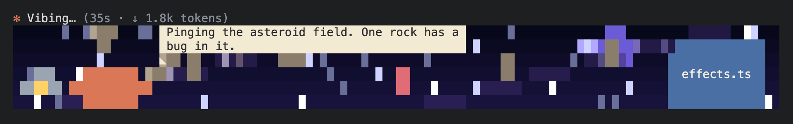
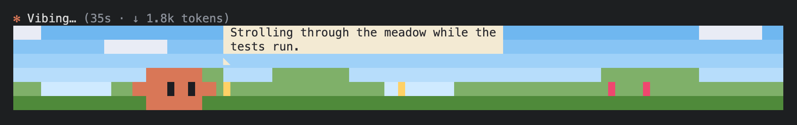
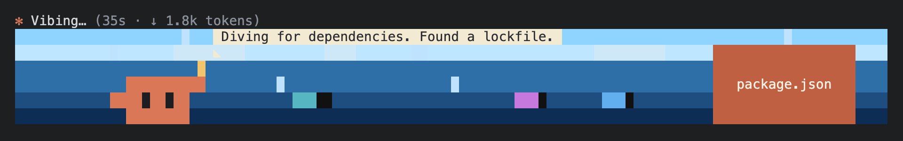
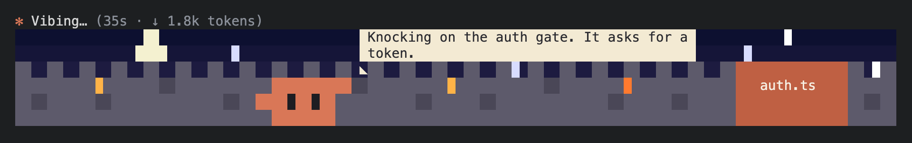
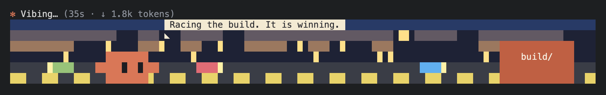

# spinner-oracle

A Claude Code mod that replaces the thinking spinner with a live pixel-art cartoon of what the main
agent is doing. Haiku 4.5 watches the agent's activity and, for each step, writes a line for the
crab's speech bubble and, when the agent moves to a new file or tool, a small program that draws the scene. The program runs in a sandboxed
interpreter at about 20 frames a second, under the engine's normal status line.

```
Vibing… (35s · ↓ 1.8k tokens)
╭──────────────────────────── 6 rows, full width ────────────────────────────╮
│  [crab]  "Pinging the asteroid field. One rock has a bug in it."  [effects.ts] │
╰────────────────────────────────────────────────────────────────────────────╯
```

## Screenshots











## Install

```sh
claude plugin marketplace add iremsinmaz/spinner-oracle
claude plugin install spinner-oracle@toon-spinner
```

Restart Claude Code. The cartoon shows under the spinner line while a turn runs, in the terminal only.

## How it works

```
 hooks (register.tsx)                narrator.ts                     script.ts + lang.ts
 ─────────────────────               ───────────                     ───────────────────
 prompt.submit ── task ──────────▶  Narrator                         Stage
 turn.start    ── "turn started" ▶   queue of events                  current scene ◀─ load(program)
 tool.call     ── "Read a/b.ts" ──▶  one request at a time ──────▶   previous scene (crash fallback)
                                     history (trimmed 30 → 15)         Typewriter (speech bubble)
 session.append ─ assistant text ▶   backoff 5s → 2 min               Canvas (W x 12 px, 1 color/cell)
 turn.complete ── stop ───────────▶  Haiku via $.model.complete
                                     reply { speech, scene } ───────▶ typer.type(speech), load(scene)

 clock.every(50ms) ── stage.frame() ── $.ui.blit ──▶ the Raster under the spinner line
```

- **`register.tsx`** registers the hooks and draws the spinner region: the engine's own line, then a
  `Raster` the width of the terminal and 6 rows tall. A 50 ms timer repaints it with `$.ui.blit`.
  If anything throws, the hook hands back the engine's spinner untouched.
- **`narrator.ts`** keeps the conversation with Haiku 4.5 through the mod API's `$.model.complete`,
  so it runs on your logged-in account (no SDK, no API key). That helper takes one message, so the
  conversation is flattened into the prompt each time: the task, the earlier replies (the latest
  scene in full, older ones as a size), and the new events. Replies are JSON `{ speech, scene }`;
  `SYSTEM` tells the model exactly what the language and API support, with one complete example.
- **`lang.ts`** is the interpreter: a tokenizer, a parser and a tree-walking evaluator for a
  JS-like language. No `eval`; a program sees only the globals it is handed. Every statement,
  loop turn and call spends from a step budget, strings and arrays are capped, and
  `__proto__`/`constructor`/`prototype` are unreachable.
- **`script.ts`** is the scene runtime: the canvas, the drawing API (`rect`, `pixel`, `line`,
  `circle`, `text`, `box`, `sprite`, `shade`), the crab and its poses, `say()`, and the speech
  bubble. **`colors.ts`** parses hex colors. **`effects.ts`** holds the backdrops and particles.

## Drawing

The scene is a canvas 12 pixels tall, but the terminal gets one color per cell: a space on a colored
background. Block glyphs (`▀ ▄ █`) would give two pixels a cell, but Apple Terminal draws them from the
font, shifted and antialiased, which leaves seams between cells and slivers of the wrong color. A
background always fills the whole cell. So each cell shows one of its two pixels:

- **Claude's**, when the cell holds one. The crab is also drawn after the scene, and a sign's label in a
  cell Claude covers is wiped, so nothing passes in front of Claude but the speech bubble.
- **Otherwise the rarer color** in its own pixel row, which keeps a star or a sign's edge over the sky or
  ground around it.

A sign drawn with `box` wipes the labels under it, so a later sign covers an earlier one cleanly.
`gradient` steps per cell row so a sky fades without stripes.

## Robustness

| Concern | What happens |
| --- | --- |
| Long conversations | At 30 exchanges the history is cut to the last 15; the task is kept apart and always sent. |
| Failed requests | Retried with backoff: 5 s, doubling, capped at 2 min. A reply that is not the JSON object counts as a failure. The loop never throws. |
| Turn ends | The loop stops, its sleep and request are aborted, and the queue is dropped. |
| Bad scene | A program that does not parse or set up is ignored. One that throws or runs out of its frame budget is dropped and the previous scene comes back (then the built-in default). |
| New scenes | Asked for only when the turn starts or the agent moves to another file or tool; other events get a speech-only request, and any scene in that reply is ignored. |
| Speech typing | A new line types out. Once it has finished, a changed version (a live counter from `say()`) shows in full at once. Calling `say()` with the same text every frame does nothing. |
| The agent | Nothing it does waits on the cartoon: events are queued synchronously and the narrator runs unawaited. |
| Frame cost | A frame of the example scene at 120 columns takes well under 10 ms (a test checks it). |

## Tweaking

**The mascot** is `drawCrab` in `hooks/script.ts`: a 12 x 5 pixel sprite drawn with `rect`/`set`.
Its colors are `CRAB` and `EYE` just above it, and its poses are the `CRAB_POSES` list. Each pose
picks the legs, arms and eyes in the function. Add a pose by adding its name to `CRAB_POSES`,
giving it a branch, and listing it in the `crab(...)` line of `SYSTEM` in `narrator.ts`, so the model
knows it exists.

**Themes** are the `backdrop` switch in `hooks/effects.ts`, each layering the small effects
(`gradient`, `stars`, `ridge`, `trees`, `waves`, `cars`, …) above it. Add one by adding a `case`,
adding its name to `THEMES`, and saying what it fits in the backdrop line of `SYSTEM`. Effects are
pure functions of `t` (no state kept between frames), which keeps them cheap and leak-free.

**The narrator**: `MODEL`, `MAX_TOKENS`, `TRIM_AT`/`TRIM_TO` and `BACKOFF_*` sit at the top of
`narrator.ts`. `DEFAULT_SCENE` is what shows before the first reply of a turn, and `EXAMPLE_SCENE`
is the example program in the system prompt.

**Budgets**: `FRAME_BUDGET` and `SETUP_BUDGET` in `script.ts`; `FRAME_MS` (frame rate) in
`register.tsx`.

## Commands

| Command | What it does |
| --- | --- |
| `/close-spinner` | Turns the cartoon off at once (the request in flight is aborted, no more model calls). Remembered across sessions. |
| `/open-spinner` | Turns it back on, from the next turn. |
| `/spinner-usage` | The narrator's requests and tokens (input, cache, output) since the mod loaded. |

## Cost

Every batch of events is one Haiku request on your account, and the prompt carries the system prompt
and the recent history. Only one request runs at a time, and events that arrive meanwhile go out
together in the next one, but a long, busy turn still makes many requests. A full scene program is
written only when the agent changes file or tool; the rest are speech-only replies. Run
`/spinner-usage` to see what it actually costs, and `/close-spinner` when you would rather not pay it.

## Develop

```sh
claude --plugin-dir ./      # load it from this folder; edits hot-reload
claude plugin validate ./
claude plugin test ./       # interpreter, colors, narrator, typing, stage and the hooks
```

## License

MIT
