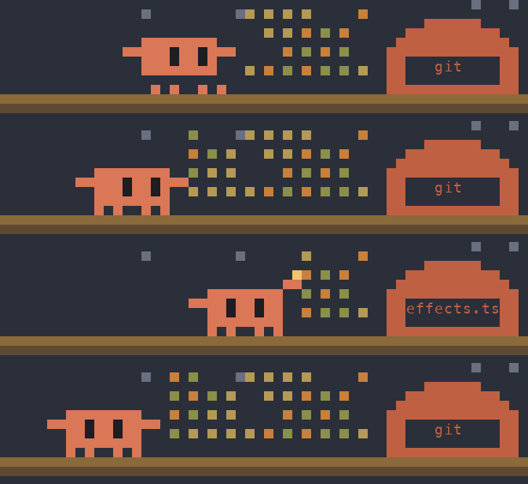
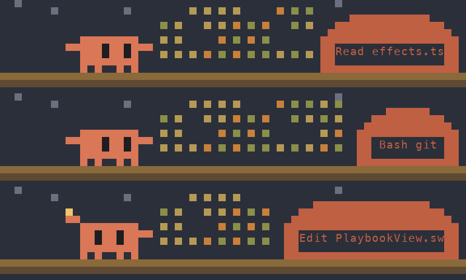

# toon-spinner

A Claude Code mod: while a turn runs, a little pixel-art Claude plows a crop field toward a barn
labeled with the tool and file it is working on, with a one-line caption Sonnet writes for each tool call.



Claude's pose follows what it is doing:

| Doing | Pose |
| --- | --- |
| Bash | runs and hops |
| Read, Grep, Glob | strolls, eyes glancing side to side |
| Edit, Write | plants its feet and hammers, sparks flying |
| between tools | ambles along |

The barn's sign reads like `Read effects.ts` or `Bash git`, and widens to fit (up to 20 cells):



## Install

```sh
claude plugin marketplace add iremsinmaz/toon-spinner
claude plugin install toon-spinner@toon-spinner
```

Restart Claude Code. The scene shows in the band above the prompt from the first tool call of a turn until the turn ends.

## Notes

- **Terminal only for the scene.** It is drawn with half-block characters in 24-bit color; the desktop app shows the caption alone.
- **Cost.** Each main-agent tool call sends one small request to `claude-sonnet-5-5` (60 output tokens max) for the caption. Only one runs at a time, and the newest tool call wins.
- **Early-access API.** This uses Claude Code's function-hooks plugin API (written against 2.1.287), which may change between releases.

## Develop

```sh
claude --plugin-dir ./                  # load it from this folder; edits hot-reload
claude plugin validate ./
claude plugin test ./
```

`hooks/register.tsx` holds the hooks, `hooks/paint.ts` draws the scene, `hooks/toon.test.tsx` holds the tests.

## License

MIT
